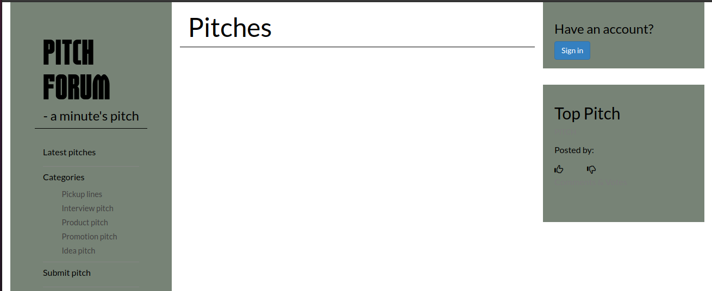

# PitchForum
#### An app that allows one to post and react to one minute pitches in different categories, 01/03/2021
#### By [Ryan Rotich](https://github.com/RYAN2540)

### [PitchForum App](https://pitchforum.herokuapp.com/)

## Description

<table>
<tr>
<td>
PitchForum is an app where users can post pitches that they deem impressive. The idea is that in life you only have 60 seconds to impress someone. One minute can make or break you. How do you make sure that you use your 1 minute to actually say something meaningful?

On PitchForum, users submit their one minute pitches and other users will vote on them and leave comments to give their feedback. The pitches are organized in categories that include product pitch, interview pitch and pickup lines among others. As a user you'll have to create an account and be signed in to post a pitch, vote and leave a comment. Without signing in, you can only view pitches in different categories. Make your account today and start pitching!
</td>
</tr>
</table> 

#### Latest updated version is on 3rd March 2021.

## Technologies used

1. Python v3.9
2. Flask 1.1.2
3. Postgres
4. SQLAlchemy
5. Flask-Bootstrap
6. HTML & CSS

## Development

The app has been developed with Flask 1.1.2. It uses PostgreSQL database and SQLAlchemy. Database migrations are tracked with ALembic. Email communication uses the Google SMTP server. The app is deployed on Heroku. It's source code is available on GitHub at https://github.com/RYAN2540/PitchForum

## Setup & Run instructions
- Install the dependencies listed on `requirements.txt`.
- Configure your app to include `SECRET_KEY`, `MAIL_USERNAME`, and `MAIL_PASSWORD` environment variables.
- Run your app on `development` config for debugging purposes.

To contribute to this project on any modules, follow these easy steps:

- Fork the repo
- Create a new branch in your terminal (git checkout -b improve-feature)
- Make appropriate changes in file(s)
- Add the changes and commit them (git commit -am "Improve App")
- Push to the branch (git push origin improve-app)
- Create a Pull request

## Support and contact details
For any queries, issues, ideas or concerns contact [Ryan Rotich](austinbrian005@gmail.com). Your feedback is highly appreciated. 
### [License](LICENSE)
MIT license
Copyright (c) 2020 **Ryan Rotich**